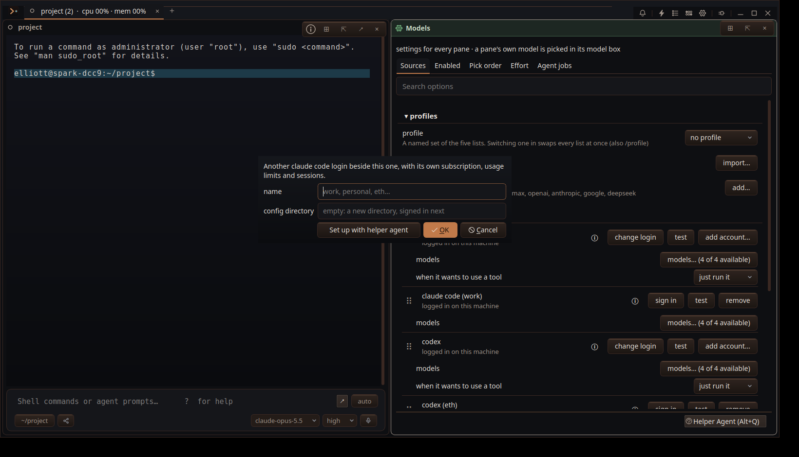
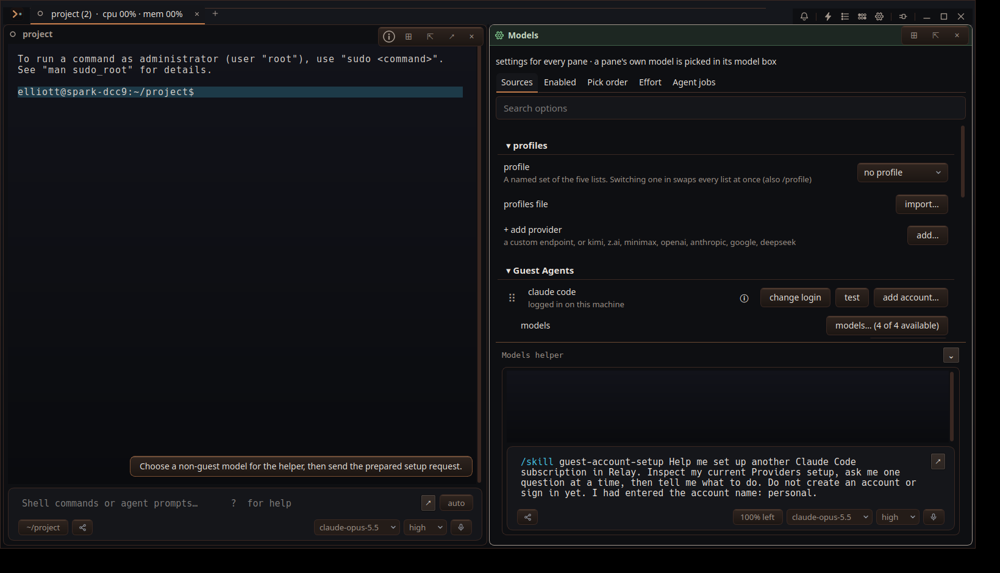

# Guide users through adding guest subscription accounts in Providers

## Issue
make a note, we need to have a system in the providers page to help people set this up. probably with a helper agent / skill.
Owner follow-up: "right, so in the add account, include a \"set up with helper agent\" button, that puts you in the helper agent chat with the skill where it analyzes your set up, interviews you, and tells you waht to do"

## Discussion points
The Models pane already has a helper (#MH7P), and #M8S2 supplies account registration and separate CLI config directories. The setup skill should guide the user through choosing Claude Code or Codex, selecting a new or existing directory, signing in with the CLI when needed, testing the login, and offering that account's models. A helper on a guest-only model currently cannot use the app tools (#GH5T); the button preserves a prepared skill request until a non-guest helper model is chosen.

## Done means
- Add account has a **Set up with helper agent** action alongside the manual form.
- Clicking it closes the form, focuses the Models helper on Providers, and carries the selected CLI and any entered name or directory into a `guest-account-setup` skill request. With a usable helper model it starts the interview; otherwise it keeps the request in the composer and explains how to choose a model.
- The skill inspects available provider state, asks for missing decisions one at a time, and gives actionable steps for an isolated Claude Code or Codex login without reading or asking for credentials. Clicking the helper action does not save an account.
- Failure is an empty chat, a lost CLI or entered name, a switch to another helper, an account saved by the helper action, or a missing skill.

## Plan
**Goal.** Launch a guided account setup interview from the Add account dialog.

**Findings.** `RelayWindowModels.cpp` builds that dialog. The Models pane already owns one helper console (`ModelsPane::focusHelper`), and `Pane::askAgent` can submit `/skill <name> ...` so the worker attaches a bundled skill to the turn. `agent_context.py` gives the helper its Models brief.

**Steps.** 1. Add the dialog action and route it to the existing Models helper, preserving the selected CLI. 2. Bundle a `guest-account-setup` skill that surveys provider state, interviews the user, and gives safe manual steps. 3. Add focused tests for the route and skill loading; capture the visible dialog and helper handoff.

**Risks.** The dialog can also be opened from Options, so the route must find or open the Models pane. The helper may be configuring when the click arrives; use the normal agent queue and skill slash path. Keep credentials out of prompts and diagnostic output.

**Verify.** Build the Relay target, run the Models pane and skill tests, and drive the Add account button in an isolated profile.

## Decisions
2026-09-23, owner: "right, so in the add account, include a \"set up with helper agent\" button, that puts you in the helper agent chat with the skill where it analyzes your set up, interviews you, and tells you waht to do". The Add account button opens the existing Models helper with a dedicated bundled skill.

## Execution Summary
Added **Set up with helper agent** to the Add account dialog in `src/RelayWindowModels.cpp`. The action leaves the account unsaved, opens the Models helper on Sources/Providers, and starts `/skill guest-account-setup` with the chosen CLI and any typed name or directory. If the helper has no usable non-guest model, the request stays in its composer with a model-selection hint.

Bundled `backend/relay_core/skills_bundled/guest-account-setup/SKILL.md` surveys Models provider rows, asks one missing question at a time, and gives the account-specific sign-in and test steps without reading credentials. The Models context brief points to the skill.

A live model interview remains for independent verification; the isolated evidence run deliberately makes no model request.

## Tests
`tests/test_skills.py`
`tests/test_agent_context.py`
`ctest -R '^modelspane$'`
manual: docs/qa_evidence/2026-09-23-21KQ/

`PYTHONPATH=backend python3 -m unittest tests.test_skills tests.test_agent_context`: 52 passed. `RELAY_SESSION=card21kq scripts/relay-build --target relay`: built. `xvfb-run -a ctest --test-dir build -R '^modelspane$' --output-on-failure`: 1/1 passed. The Xvfb driver also asserted that the helper click did not save `personal` to the account registry.

### Check 2026-09-23 23:23
- missing-evidence · unittest:tests.test_skills — no run of tests/test_skills.py for this revision, from any host, and no attached result
- passed · unittest:tests.test_agent_context — tests/test_agent_context.py passed for this revision on spark-dcc9, 2026-09-24T00:06:22Z
- passed · ctest:modelspane — ctest -R modelspane passed for this revision on spark-dcc9, 2026-09-24T03:23:08Z
- not-applicable · manual:docs/qa_evidence/2026-09-23-21KQ/ — manual evidence, recorded by hand: docs/qa_evidence/2026-09-23-21KQ/
- notice · unittest:tests.test_skills — tests/test_skills.py: 8 of 36 never ran here (test_parse_profile_reads_vocabularies_lists_and_free_text, test_unknown_key_is_a_warning_not_an_error, test_bad_values_are_warnings_and_dropped…)
- notice · ctest:modelspane — ctest -R modelspane is slow: p95 1.86 s, p50 1.60 s
history: thread
