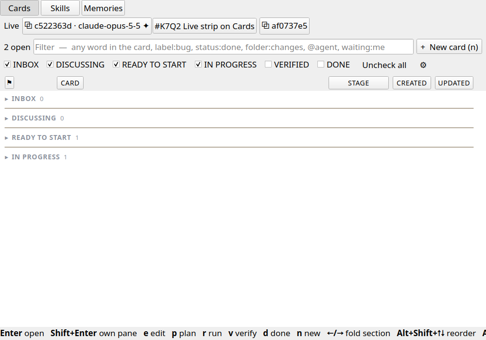

# Live strip on Cards: this project's panes and the card each holds

## Issue
Phase 3 of the object model (#EA37 decision 3, owner 2026-09-25): no pane tab — a computed Live strip on the Board's Cards tab listing the panes attached to this project and the card each holds. The Projects page keeps attach/reveal/filter. A pane is never a stored link target; the strip is computed on each refresh. Blocked on #9FX8's tab surface (step 2 landed in b48afea2; the card is still executing).

## Done means
- The Board's Cards tab shows a **Live** strip at its top with one chip per open terminal pane attached to this project (its tab's project or its workspace is the board's): the token's first eight, the pane's model, ✦ while a turn runs, and the open card(s) whose `session` is that pane's token.
- Clicking a pane chip reveals that pane (`onFocusPane`); clicking a card chip opens the card.
- The strip is hidden when no pane is attached, on the Skills and Memories tabs, while the sections editor is open and on a pinned card pane (#Y2BA) — and it writes nothing: no card field, no protocol message.
- Failure looks like: a strip with no panes still drawn, a strip on Skills/Memories, a chip naming a closed card, or a pane in another project listed.

## Plan
**Goal.** A computed Live strip at the top of the Cards tab (docs/PROJECT-BOARD-DESIGN.md §6, #EA37 decision 3), nothing stored.

**Findings.**
- `src/BoardPane.cpp` `buildChrome` → `buildPageTabs` is the tab row; `applyPage()` is the visibility rule `rebuild()` ends on; `m_pinned` marks a pinned card pane.
- `board::Model::claimedBy(token)` (src/BoardModel.cpp) already answers the open cards a pane holds, from each card's `session` field (#R9G7/#0FBB).
- The window already walks every pane with its project for the Projects page (`RelayWindow::feedProjects`: `allPanes()`, `tabProject(pageOf(pane))`, `dimmingAgentBusy()`), and wires `view->paneExists` / `onFocusPane` for the board. `Pane::paneModel()` is the pane's own model.

**Steps.**
1. `BoardView` gets one more window callback, `livePanes` → `[{token, title, model, busy}]` for the panes attached to this workspace; no worker request.
2. `BoardView::buildLiveStrip` (a row under the tab row, object name `boardLiveStrip`) and `syncLiveStrip()` — chips per pane plus its `claimedBy` cards; re-run at the end of `rebuild()` and on a 2 s timer while the pane is visible (panes open/close without a board event).
3. Wire `view->livePanes` in `RelayWindow.h` beside `paneExists`: every window's `allPanes()` whose tab project or workspace equals the board's workspace.
4. Test `BoardPaneTests::theLiveStripListsThisProjectsPanesAndTheirCards`.
5. Evidence screenshot offscreen; a paragraph in docs/BOARD-DESIGN.md §4.0.

**Risks.** `BoardPane.cpp`/`RelayWindow.h` carry many sessions' uncommitted edits: my hunks stay in new functions plus one line in `buildChrome`, `rebuild` and the wiring block. No new fast path, so no shortcut hint.

**Verify.** `ctest --test-dir build -R BoardPaneTests`; offscreen screenshot in docs/qa_evidence/2026-09-25-tbrh-live-strip/.

## Execution Summary
- `src/BoardPane.cpp`: `BoardView::buildLiveStrip` puts a `boardLiveStrip` row, laid out with a `FlowLayout`, under the Cards | Skills | Memories row. `BoardView::syncLiveStrip` fills it with one group per pane: a `boardLivePaneChip` (`⧉` + the token's first eight, the model, ✦ while busy) that calls `onFocusPane`, then a `boardLiveCardChip` per open card whose `session` is that token (`board::Model::claimedBy`), each of which calls `openCard`. `syncLiveStrip` runs at the end of `rebuild()`, from `pinSolo`, and every 2 s while the pane is visible, redrawing only when what it would draw has changed. The strip is hidden with no pane, on Skills and Memories, in the sections editor and on a pinned card pane.
- `src/BoardPane.h`: the `livePanes` window callback, which returns `[{token, title, model, busy}]`, plus the strip's members.
- `src/RelayWindow.h`: `view->livePanes` is set beside `paneExists`. It walks every window's `allPanes()` and keeps the panes whose tab project or workspace is the board's workspace, using the same fields `feedProjects` gives the Projects page. There is no new worker request and no stored field.
- `docs/BOARD-DESIGN.md` §4.0: one paragraph on the Live strip.
- No new fast path, so no shortcut hint.

## Tests
- `ctest --test-dir build -R ^boardpane$` (`BoardPaneTests::theLiveStripListsThisProjectsPanesAndTheirCards`)
- manual: docs/qa_evidence/2026-09-25-tbrh-live-strip/

## Human QA
- [ ] Open two agent panes on this project and claim a card from one. Does the Board's Cards tab show a Live strip with both panes and the claimed card beside its pane, and does clicking each chip reveal the pane or open the card? Does the strip disappear on Skills and Memories, and once both panes are closed (within about 2 s)?
