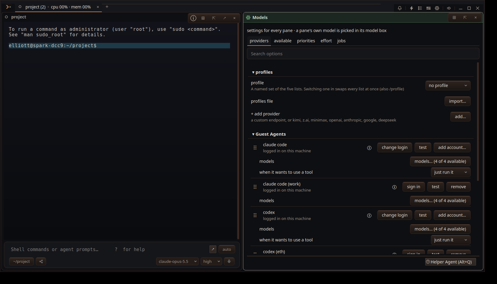
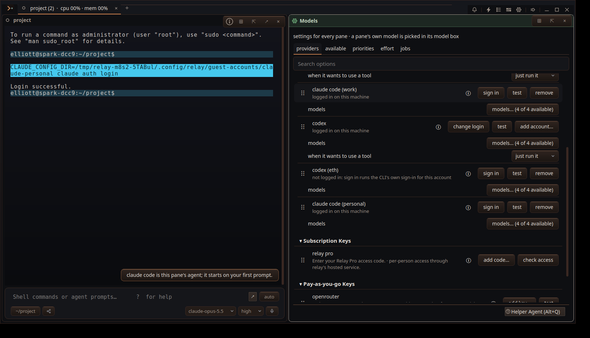
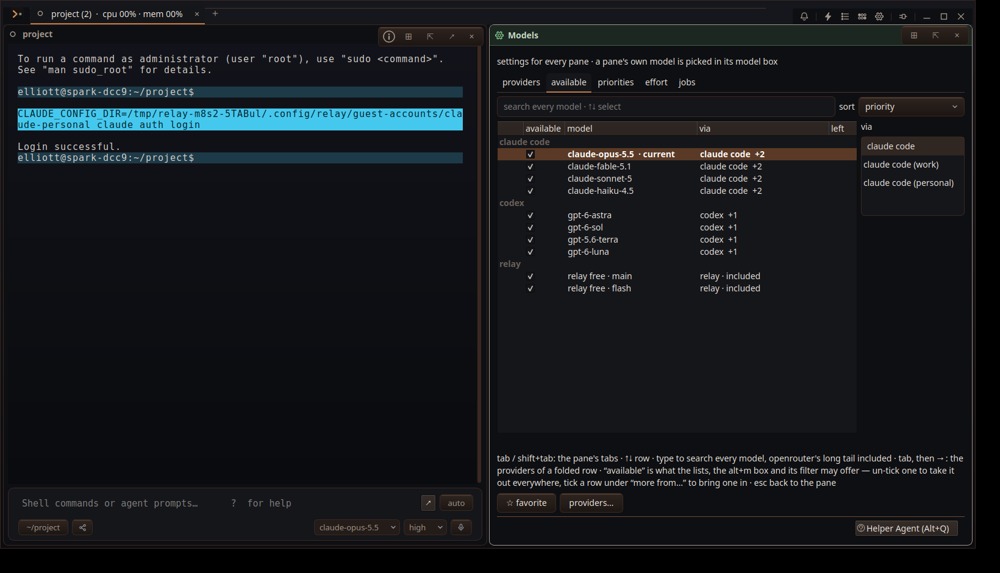

# Run several Claude Code and Codex logins side by side

## Issue
scope out running multiple simultaneous subscriptions. look on reddit to see how people do it with claude code. and see if we can use the pipeline for the multiple accounts tracker already, will that generalize to other users

2026-09-23, owner (after the scope): "whats the status on multiple guest agent logins. review what we planned or built with the config dirs." then "yes, lets build it. i'm not worried about terms of use."

## Done means
Scope (met by f41d4e20): the report above.

Build (written at landing, 2026-09-23, not before the code; the verifier should hold the work to it as written):
- A Claude Code or Codex account (a name plus a config directory) can be added, signed in, tested and removed from Options › Models. It becomes its own preset, `guest:<cli>:<id>`, and `guest:claude` / `guest:codex` behave exactly as before.
- A pane, plan turn or delegated child on an account preset starts its CLI with that account's `CLAUDE_CONFIG_DIR` / `CODEX_HOME` and without inherited API keys. It never runs on the default login: a removed account is refused, not substituted, and switching between two accounts of one CLI restarts the harness.
- Login state, usage limits and `test` results are per account. Sessions stored in an account's directory are listed, resumed and live-tailed under that account.
- Failure looks like: a pick or resume on an account runs as the default login; two accounts show one login state or one limit; an account's session is missing from the Sessions list, or resumes under the wrong login.

## Plan
**Goal.** Let a user register and run several subscriptions at once, with each model choice tied to the correct account and quota.

**Design.** Give every subscription a stable account ID. Claude Code and Codex accounts launch with separate `CLAUDE_CONFIG_DIR` or `CODEX_HOME`; Z.AI and Kimi Code accounts use distinct preset IDs and keyring entries. Keep credentials in the CLI or keyring.

**Steps.** 1. Add account registration, display names, and account-aware model rows while preserving existing default IDs. 2. Carry the account ID through tier and job picks, process launch, planning, subagents, session persistence, resume, and failover. 3. Key usage and reset windows by account, poll each configured plan key, and use fresh quota data to weight draws only among tied ranks. 4. Add isolated launch, routing, quota, migration, and two-account live checks across supported platforms.

**Risks.** A reused harness or restored session could silently run on another login; credential-store behavior varies by platform; idle Claude/Codex quota endpoints are undocumented. Keep unknown or stale usage neutral in selection.

**Full scoping report.** [Multiple subscription routing in Relay](../../reports/Multiple%20subscription%20routing%20in%20Relay.md). The report includes Reddit evidence, official documentation, code paths, tracker portability analysis, and the test matrix.

## Execution Summary
Built the Claude Code / Codex half of the plan: steps 1–2, plus step 3's per-account limits. The Z.AI / Kimi plan-key half is #VZ54.

- `backend/relay_core/guest_accounts.py` (new): the registry `$XDG_CONFIG_HOME/relay/guest-accounts.json`; per-account environment (config directory set, overriding API keys removed); `login_command`; the `guest_accounts` / `guest_account_save` / `guest_account_delete` protocol.
- `guest_harness_provider.py`: `guest:<cli>:<id>` presets (`preset_key`, `preset_account`, `config_account`, `config_preset`, base URL `harness://<cli>/<id>`). One `presets` row per account, with its own `logged_in`, `limits` and `login_command`. `make_harness(account=)`; switching accounts restarts the harness; `guest_account` in `configured` and the saved session; resume stays on its account; `refresh_logins`.
- Adapters: `env_overrides` / `env_remove` on the spawned process (`guest_harness_claude.py`, `guest_harness_codex.py`).
- Routing: `roles.py` (key-aware `guest_runnable`, `guest_base_url`), `guest_child.py`, `agent.py` (a plan turn and a delegated child keep the account), `model_ranking.py` (an account ranks with its CLI), `keytest.py` (per-account test and login hint), `session_protocol.py`, `worker.py`.
- Sessions: `guest_sessions.py` indexes each account's `projects/` / `sessions/` + `state_*.sqlite` and live-tails that account's directory; `conv_index.py` stores the account preset in the row's `preset`.
- GUI: Options › Models (`RelayWindowModels.cpp`): *add account…* on a CLI's default row; *sign in / test / remove* on an account row. `Pane.h`: `guestOfPreset` returns the CLI, picks and resumes keep the full preset, an account never falls back to the Tier B default-login launch, and a finished sign-in sends `guest_logins_refresh`. `PaneEvents.cpp` / `RelayWindowCore.cpp` handle the save events; `RelayWindow.h` `openGuestPane` takes the preset.
- Protocol: `docs/AGENT-SESSIONS-PROTOCOL.md` §29.6.

Live against this machine's CLIs (details in the evidence README): the usage tracker's five homes all answer logged in through Relay as separate rows with distinct identities. A real test turn on `guest:codex:gmail` answered "ok"; `guest:codex:eth` answered with its own usage limit. `guest:claude:gmail` was blocked by a stale `.oauth_refresh.lock` in the tracker's directory (19:00, the tracker's hourly run), which was left alone.

Not verifiable here: macOS Keychain (per-directory entry) and Windows paths; this machine is Linux.

Follow-up `0dbcbfa5`: the account-row test now waits for its background catalog scan while its mocked CLI discovery is active, preventing that scan from changing the next test's catalog state.

## Tests
`tests/test_guest_accounts.py`
`tests/test_guest_harness_provider.py`
`tests/test_keytest_guest.py`
`tests/test_guest_sessions.py`
`tests/test_model_switch.py`
`tests/test_roles.py`
manual: docs/qa_evidence/2026-09-23-guest-accounts-M8S2/

### Check 2026-09-25 20:08
- missing-evidence · unittest:tests.test_guest_accounts — no run of tests/test_guest_accounts.py for this revision, from any host, and no attached result
- missing-evidence · unittest:tests.test_guest_harness_provider — no run of tests/test_guest_harness_provider.py for this revision, from any host, and no attached result
- passed · unittest:tests.test_keytest_guest — tests/test_keytest_guest.py passed for this revision on spark-dcc9, 2026-09-23T23:18:38Z
- passed · unittest:tests.test_guest_sessions — tests/test_guest_sessions.py passed for this revision on spark-dcc9, 2026-09-23T23:18:12Z
- missing-evidence · unittest:tests.test_model_switch — no run of tests/test_model_switch.py for this revision, from any host, and no attached result
- passed · unittest:tests.test_roles — tests/test_roles.py passed for this revision on spark-dcc9, 2026-09-26T00:08:17Z
- not-applicable · manual:docs/qa_evidence/2026-09-23-guest-accounts-M8S2/ — manual evidence, recorded by hand: docs/qa_evidence/2026-09-23-guest-accounts-M8S2/
- notice · unittest:tests.test_guest_accounts — tests/test_guest_accounts.py: 6 of 26 never ran here (test_the_relay_home_and_the_users_own_are_both_owned, test_claude_names_its_config_dir_and_the_sidecar_file, test_an_env_override_is_owned_and_the_default_stays_listed…)
- notice · unittest:tests.test_guest_harness_provider — tests/test_guest_harness_provider.py: 12 of 83 never ran here (test_guest_quota_refusal_keeps_a_structured_reason, test_exhausted_guest_retries_on_another_login_without_spending_a_reset, test_guest_tool_before_quota_refusal_is_not_replayed…)
- notice · unittest:tests.test_guest_harness_provider — tests/test_guest_harness_provider.py: 1 of 83 are slow (test_guest_startup_and_changes_report_each_models_supported_efforts)
- notice · unittest:tests.test_guest_harness_provider — tests/test_guest_harness_provider.py: 3 of 83 are not in the project any more (test_a_model_picked_after_the_stand_in_replaces_it, test_the_helper_worker_follows_the_priority_list_instead_of_starting_a_guest, test_with_nothing_usable_it_configures_anyway_and_a_turn_says_why)
- notice · unittest:tests.test_keytest_guest — tests/test_keytest_guest.py: 1 of 9 are slow (test_a_guest_that_never_answers_is_timed_out_and_closed)
- notice · unittest:tests.test_model_switch — tests/test_model_switch.py: 8 of 34 never ran here (test_a_queued_switch_lets_the_turn_finish_whole_and_lands_at_its_end, test_a_queued_switch_does_not_cut_a_retry_wait_short, test_steering_a_queued_switch_lands_it_at_the_next_step…)
- notice · unittest:tests.test_model_switch — tests/test_model_switch.py: 1 of 34 are slow (test_the_next_request_goes_to_the_other_provider_with_its_history_converted)
- notice · unittest:tests.test_roles — tests/test_roles.py: 10 of 93 are not in the project any more (test_a_later_set_model_clears_the_note, test_a_role_pick_still_wins_over_where_the_resolver_landed, test_nothing_usable_leaves_the_resolver_on_the_guest_and_says_so…)
- warning · manual:docs/qa_evidence/2026-09-23-guest-accounts-M8S2/ — manual evidence docs/qa_evidence/2026-09-23-guest-accounts-M8S2/ is not there
history: thread
