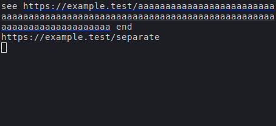

# Wrapped link hover — #H7WR

The rendered regression uses a 50-column terminal and a URL spanning three rows, both plain text and an OSC 8 run. Hovering each row underlines all three; nearby text and a separate URL stay unhighlighted. Moving away clears all three rows. Existing click, keyboard walk, Markdown-label, and fold-link checks pass.

Built with `scripts/relay-build --target relay-engine-tests`.

Executed under Xvfb with an isolated configuration:

```sh
XDG_CONFIG_HOME=/tmp/relay-hover-config QT_QPA_PLATFORM=xcb RELAY_ENGINE_TEST=ViewTest xvfb-run -a build/engine/relay-engine-tests wrappedLinkHoverUnderlinesEveryRow ctrlClickLinksAndPaths keyboardLinkWalk markdownLinkLabelsAreClickable aLinkInsideAFoldOpens
```

Result: 7 passed, 0 failed (including setup/cleanup), Qt 5.15.13, libvterm. Only libvterm is available in this build.

The screenshots show the pointer on the middle row (the capture omits the pointer). The plain-link image was visually inspected: all three segments underline, and the prefix, suffix, and separate URL do not.



