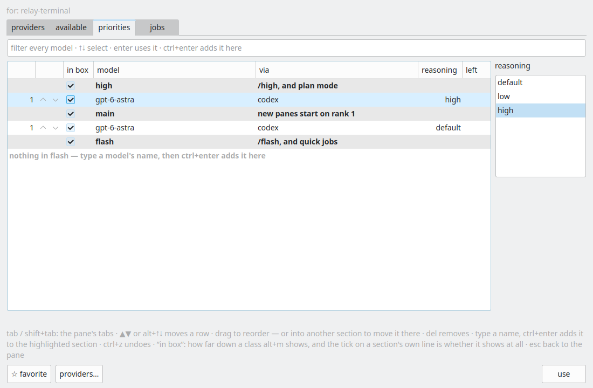

# CDP7 implementation evidence

The shared helper-catalog omission also hides Codex even when Providers has discovered it. Fixed through the same catalog routing change as VPR7. A worker-shaped Codex row (label but no provider field) is searchable and addable to Main and High in the staged test. Empty-query unranked hiding and exclusion from Flash/Lite are intentional and unchanged. No separate Codex search/filter defect was reproduced; sphinxpad verification is still needed to establish whether this shared cause explains the reported machine.

Validation:
- `scripts/relay-build --target relay-modelspane-tests relay-settings-tests` passed.
- Isolated XDG_CONFIG_HOME and `xvfb-run -a build/relay-modelspane-tests`: 21 passed.
- `QT_QPA_PLATFORM=offscreen build/relay-settings-tests providersAndPrioritiesReadTheSameServedPane everyProviderRowHasAModelsLinkIntoTheAvailableTab`: 4 passed including setup/cleanup.
- `python3 -m unittest discover -s tests -p test_openrouter_catalog.py`: 13 passed.
- `python3 -m unittest discover -s tests -p test_guest_harness_provider.py`: 68 passed.
- `python3 scripts/relay-board.py check`: existing board-wide 12 errors / 754 warnings, unrelated to these cards.

Screenshots are real Qt widgets under Xvfb with synthetic provider payloads, not a live provider call or a reproduction on sphinxpad. `ssh -o BatchMode=yes -o ConnectTimeout=5 sphinxpad` timed out. The initial build invocation named a nonexistent relay-settingspane-tests target; the corrected target passed. An initial Codex test forgot that adding clears search; correcting the test to search again passed without changing eligibility.

Implementation commit: `3cb7ff33ba054175c93c10b699f0c08804e12f07`. `scripts/land.py` built the exact merged Relay application tree successfully before landing; only the three model-routing hunks in RelayWindow.h were included.

Board `TestsCommands.check_card` was run for both linked cards: no orphaned tests, errors, or warnings. Its remaining `never-run` notices refer to machine test-history records; the direct unittest executions above passed but do not populate that store. Board-wide validation reports no findings for either assigned card/thread.

## Confirmed seven-model default-availability defect

Review of the real ATP7 screenshot found Codex logged in but reporting 0 of 7 models available. `catalogFrom` set `openEnded = models.size() > 6` for every provider. Codex's finite guest model list has no `tier` markers; the open-ended default rule therefore hid every model from Available. This is a demonstrated default-availability defect, distinct from intentional unranked hiding in an empty Priorities search. Priorities search uses `allUsable`, so it was not itself blocked by this availability error.

Guest harness catalogs are now exempt from the open-ended heuristic. `sevenCodexModelsRemainAvailableByDefault` fails before the fix (0 instead of 7), passes afterward, and verifies explicit unchecking still works. All 68 model-catalog checks pass, including OpenRouter long-tail behavior.

The full-application stage in `../2026-09-22-VPR7/stage.py` injects seven untiered guest models through the real worker pipe. `live-providers.png` shows 7 of 7 available and `live-available.png` shows all seven checked. These screenshots were visually inspected. No additional discoverability redesign is warranted: the documented search/add interaction remains intentional. Sphinxpad-specific confirmation is still outstanding, but the reported 0/7 symptom now has a reproduced and fixed root cause.
