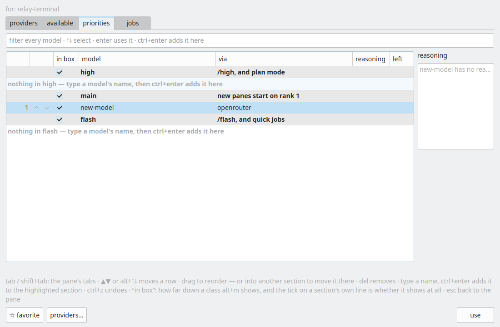

# VPR7 implementation evidence

Provider settings could use m_active while Priorities continued serving another pane. Also Providers used helper presets before the served worker answered, while Priorities read only the empty served catalog. modelsSection now resolves the served target; applyModelsTarget falls back to the same helper catalog on open and refresh; the provider models link preserves that target.

Validation:
- `scripts/relay-build --target relay-modelspane-tests relay-settings-tests` passed.
- Isolated XDG_CONFIG_HOME and `xvfb-run -a build/relay-modelspane-tests`: 21 passed.
- `QT_QPA_PLATFORM=offscreen build/relay-settings-tests providersAndPrioritiesReadTheSameServedPane everyProviderRowHasAModelsLinkIntoTheAvailableTab`: 4 passed including setup/cleanup.
- `python3 -m unittest discover -s tests -p test_openrouter_catalog.py`: 13 passed.
- `python3 -m unittest discover -s tests -p test_guest_harness_provider.py`: 68 passed.
- `python3 scripts/relay-board.py check`: existing board-wide 12 errors / 754 warnings, unrelated to these cards.

Screenshots are real Qt widgets under Xvfb with synthetic provider payloads, not a live provider call or a reproduction on sphinxpad. `ssh -o BatchMode=yes -o ConnectTimeout=5 sphinxpad` timed out. The initial build invocation named a nonexistent relay-settingspane-tests target; the corrected target passed. An initial Codex test forgot that adding clears search; correcting the test to search again passed without changing eligibility.

Implementation commit: `3cb7ff33ba054175c93c10b699f0c08804e12f07`. `scripts/land.py` built the exact merged Relay application tree successfully before landing; only the three model-routing hunks in RelayWindow.h were included.

Board `TestsCommands.check_card` was run for both linked cards: no orphaned tests, errors, or warnings. Its remaining `never-run` notices refer to machine test-history records; the direct unittest executions above passed but do not populate that store. Board-wide validation reports no findings for either assigned card/thread.

## Full application event propagation regression

`python3 docs/qa_evidence/2026-09-22-VPR7/stage.py` launches the actual Relay application with isolated XDG directories under Xvfb. A deterministic `backend/worker.py` fixture starts with no usable providers, then pushes `key_stored` and a fresh `presets` containing OpenRouter and seven Codex models, only from the tab helper. Terminal workers continue reporting no presets. No credentials, network calls, or direct widget `setTarget` calls are involved.

The driver opens Priorities and searches OpenRouter before triggering the events. The same live window retains its search and displays `late-model` afterward, verified by OCR and screenshots `live-before.png` / `live-after.png`. It then verifies the provider page says 7 of 7 Codex models available, and the Available page shows all seven. `live-events.jsonl` records actual pipe events and request types.

Red/green: running this identical driver with `RELAY_STAGE_BINARY=/tmp/claude-1000/land/azp7/verify/build/relay RELAY_STAGE_PREFIX=baseline` (the pre-VPR7 exact-tree binary) fails the `late-model` assertion. `baseline-after.png` shows no matching rows after the late events; the repaired binary passes. This establishes the helper-event regression beyond the earlier widget and source-wiring checks.

Follow-up commit: `8d03da032c8c58fbf48d4c99b866d25455f1fa0b`. Exact-tree application build passed. Rebuilt widget targets and ran `QT_QPA_PLATFORM=offscreen ctest --test-dir build -R "^(modelpicker|modelspane)$" --output-on-failure`: 2/2 targets passed.
