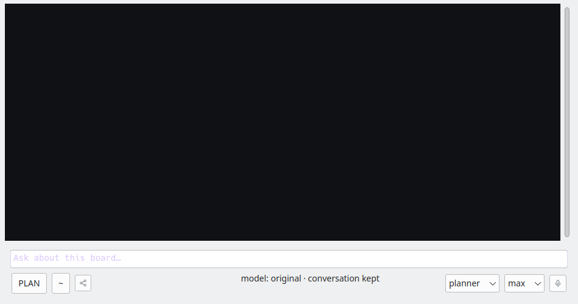

# PBKR: restore the selection when leaving Plan

The previous #PH9G implementation deliberately kept High selected on exit.
The pane now snapshots its previous role, model and effort once and restores it
through the existing conversation-preserving model-switch protocol. Main restores
through `set_model`; Flash, Local, High and console roles use `set_agent_role`.
There are no model-specific branches. Worker-driven exits restore on mode_changed;
an ongoing guest turn follows the existing deferred-switch behavior.

Checks run in the shared checkout:

- `scripts/relay-build --target relay-consolemode-tests -j2` passed.
- `XDG_CONFIG_HOME=$(mktemp -d) xvfb-run -a build/relay-consolemode-tests --plan-click-only` passed.
  This instantiates real Panes and checks emitted requests for Main/Flash/Local/High,
  manual/worker exits, repeated entry, duplicate exit events and exit before configuration.
- `PYTHONPATH=backend python3 -m unittest tests.test_guest_handover`: 9 passed.
- Board validation has no PBKR findings; unrelated existing records have errors.
- The isolated proposed-commit build and focused tests passed through land.py.
- Full `scripts/relay-build --target relay -j2` failed in unrelated in-progress
  Actions palette edits (`RelayWindow.h`: undeclared `togglePalette`/`m_palette`).
  Reported on #MAGP, with output in `/tmp/planback-app-build.log`. The running app
  has not been replaced with this fix.

The screenshots below are real Pane widgets driven by scripted worker events,
using generic models named original and planner. They do not claim a live provider
round trip. Before and after have the same original model and high effort; Plan
shows the planner at max. The protocol assertions establish the restore request.

The landing gate builds the exact proposed commit in land.py's isolated verification
tree and runs the same focused tests before committing. Independent live verification
remains on the card. This does not add persistence of the temporary snapshot across
an application restart.
