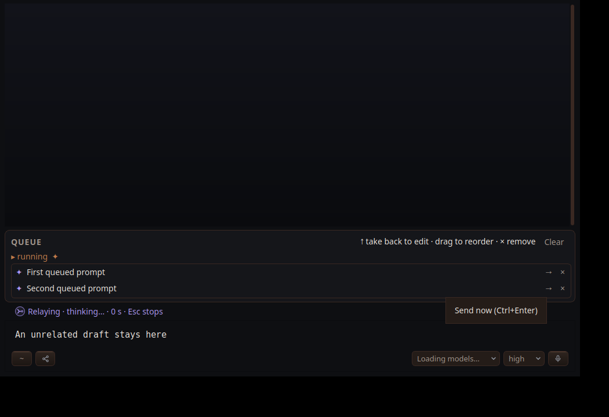

# QSN1 implementation evidence

Queued agent prompts and pending local steers offer a right arrow beside × on
their own rows. Hover reads `Send now (Ctrl+Enter)` with the live key binding.
The click sends the row through the existing interrupt path, preserving the
saved prompt metadata, unrelated composer draft, and remaining queue order.
Worker-owned rows, shell commands, and TUI guest commands have no corresponding
agent-interrupt operation here and do not offer the arrow.

The real Pane test `queueRowArrowSendsOnlyThatPrompt` queues two prompts, hovers
the second arrow, checks its tooltip, clicks it, and checks the outgoing
`ask` uses `when: interrupt`, only that row leaves, and the draft survives.
Worker events are simulated; no model provider is called.

Passed:

```sh
XDG_CONFIG_HOME=/tmp/relay-qsn1-config QT_QPA_PLATFORM=xcb \
RELAY_QUEUE_ARROW_CAPTURE="$PWD/docs/qa_evidence/2026-09-22-queue-send-now/01-arrow.png" \
xvfb-run -a -s '-screen 0 1050x720x24' build/relay-consolemode-tests --queue-arrow-only
```



The broader `ctest --test-dir build -R '^consolemode$' --output-on-failure`
fails in the existing `repeatedEnterKeepsTheFirstQueuedPrompt` assertion that
exactly one worker message was sent, before this new case runs. The failure
also reproduces with isolated XDG settings; tracked by #VZ8C and noted on #QFF1.
