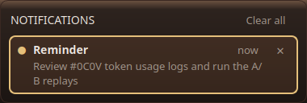

# #WJ0H implementer evidence — Relay reminders

The agent tool `app_reminder` has set, list and cancel actions. The worker validates its
arguments; the GUI stores pending reminders in an atomically replaced JSON file, locks it
before claiming a due item, and checks for missed reminders when Relay starts. At due time
Relay posts a reminder-kind notification, plays the desktop bell sound on Linux when
available (or the Qt system bell), and requests a desktop alert when that option is on.

## Checks run

- `PYTHONPATH=backend python3 -m unittest tests.test_app_tools`: 84 passed.
- `scripts/relay-build --reconfigure --target relay-reminders-tests relay-appcommands-tests relay`: passed.
- `scripts/relay-build --target relay-reminders-tests relay-appcommands-tests relay`: passed after the final C++ edits.
- `ctest --test-dir build -R '^(reminders|appcommands|notifications)$' --output-on-failure`: 3 passed.
- `PYTHONPATH=backend python3 -m unittest tests.test_app_tools tests.test_guest_board_bridge`: 103 passed, two guest bridge discovery tests failed because a separate media feature added four tool names while its expected set/count still excludes them. The app tool tests, including reminder validation, passed.

The image below is from an isolated Qt profile under Xvfb. The capture used Relay's
`Reminders` store to schedule a reminder, advanced to its due time, then displayed the
result through the real `NotificationCenter`, `NotificationsPopup` and theme stylesheet.
The capture exercised the bell call but Xvfb cannot establish audibility on the user's
desktop. The app's built-in sound path uses `canberra-gtk-play --id=bell` on Linux where
available and `QApplication::beep()` elsewhere.

