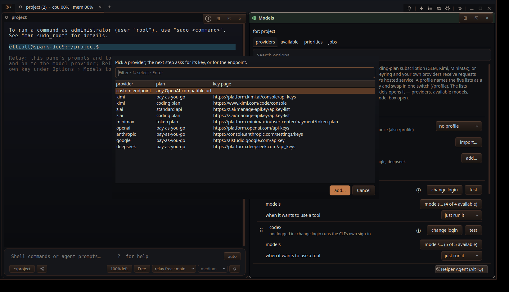

# Add provider picker

Captured from a fresh isolated Relay configuration under Xvfb after opening Models → Providers → Add provider.

The picker names the provider in its first column and uses the plan column to distinguish keys for the same provider. No model name appears in a choice.
