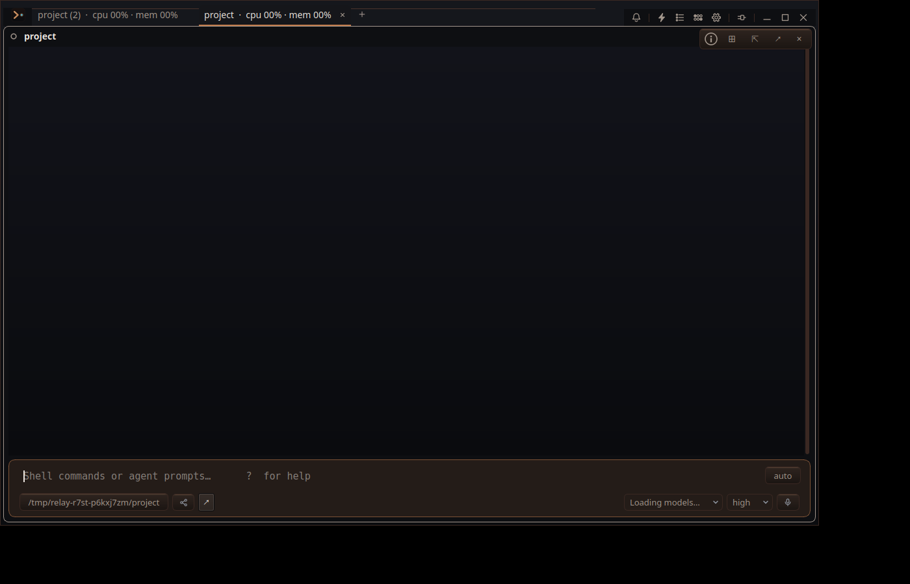

# `/restart` isolated GUI drive (#R7ST)

Built `relay` with `scripts/relay-build --target relay` (build `2026-09-23.14H.07`) and ran it under Xvfb with separate `XDG_CONFIG_HOME`, `XDG_DATA_HOME`, and `XDG_RUNTIME_DIR`. The production Relay process and layout were untouched.

1. Started `build/relay --workspace <isolated project>` as PID 1221051.
2. Opened a second tab with Ctrl+T and entered `/restart` in the prompt box.
3. The old process exited with code 0. Its log records `gui_quit` at 18:19:06.940 UTC; the replacement process, PID 1222025, records `gui_start` at 18:19:07.149 UTC.
4. The replacement reopened one window with both tabs. The saved layout retained two scrollback references, and both scrollback files existed.

The machine-readable result is [drive.json](drive.json). The image below shows the two restored tabs in the replacement process:

The first two drive attempts were harness setup errors: the first shared the live runtime lock; the second looked for the replacement PID using a faulty environment scan even though its log showed a successful restart. The final drive used an isolated runtime directory and read the replacement PID from its own log.
