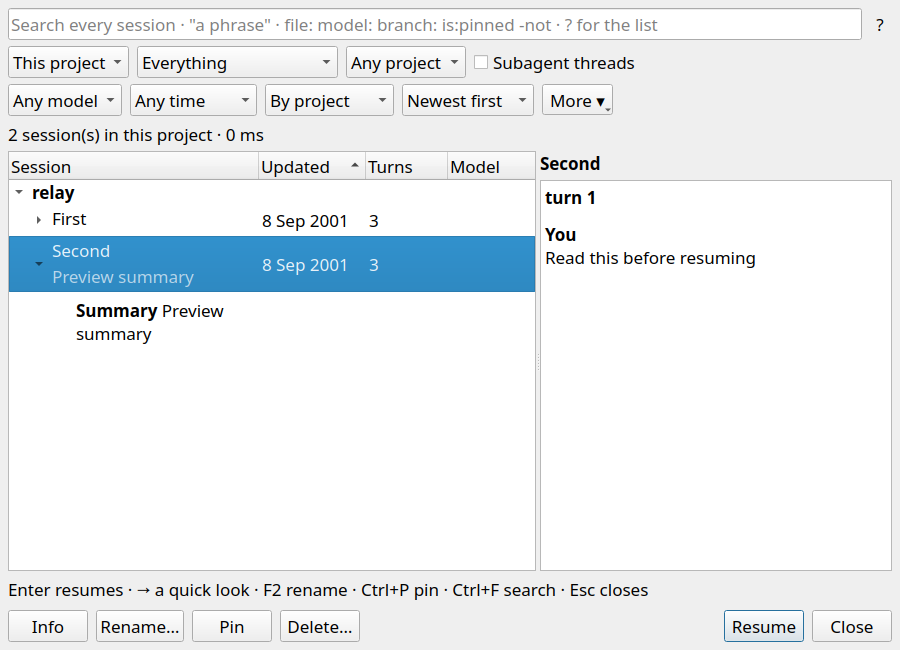

# Sessions row preview on click

- `scripts/relay-build --target relay-conversations-tests` — passed.
- `QT_QPA_PLATFORM=offscreen RELAY_SHOT_DIR="$PWD/docs/qa_evidence/2026-09-23-sessions-preview-click" build/relay-conversations-tests mouseSelectionPreviewsBeforeExplicitResume` — passed: a click and double click kept the resume callback at zero, displayed the selected session's preview, then Enter and Resume each invoked it once.
- `QT_QPA_PLATFORM=offscreen ctest --test-dir build -R '^conversations$' --output-on-failure` — passed (1/1 suite).

