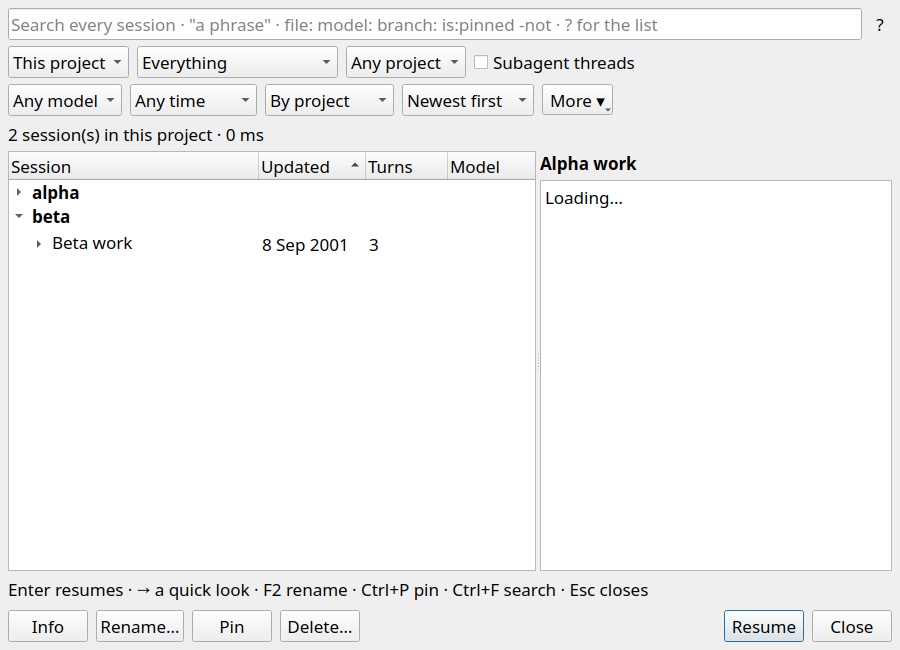

# Sessions project collapse across refresh

- `scripts/relay-build --target relay-conversations-tests` — passed.
- `QT_QPA_PLATFORM=offscreen RELAY_SHOT_DIR="$PWD/docs/qa_evidence/2026-09-23-sessions-project-collapse" build/relay-conversations-tests collapsedProjectStaysCollapsedAcrossResults` — passed after the fix. Before the final selection-restoration change, this test failed at the post-refresh collapsed assertion.
- `QT_QPA_PLATFORM=offscreen ctest --test-dir build -R '^conversations$' --output-on-failure` — passed (1/1 suite).

