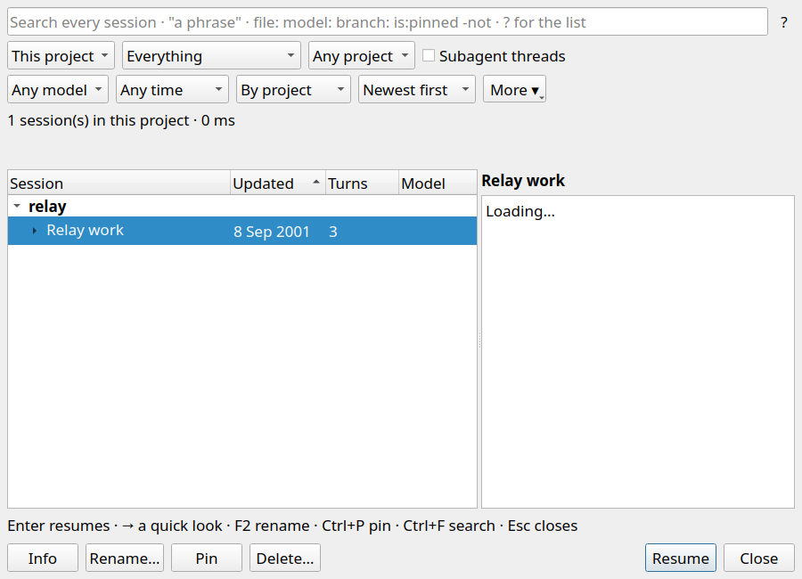

# Sessions project scope

- `scripts/relay-build --target relay-conversations-tests` — passed.
- `QT_QPA_PLATFORM=offscreen RELAY_SHOT_DIR="$PWD/docs/qa_evidence/2026-09-23-sessions-scope" build/relay-conversations-tests scopeChoiceClearsConflictingProjectFilter` — passed. It selects a specific Project filter, switches to This project and All projects, and reselects All projects while that filter is active; each explicit scope choice sends a query without the conflicting filter.
- `QT_QPA_PLATFORM=offscreen ctest --test-dir build -R '^conversations$' --output-on-failure` — passed (1/1 suite).
- `python3 -m unittest tests.test_conv_index.IndexTests.test_scope_and_filters tests.test_conv_index.ProtocolTests.test_scope_project_uses_the_requested_workspace tests.test_conv_index.ProtocolTests.test_project_operator_reports_the_scope_it_switched_to` — passed (3/3).

