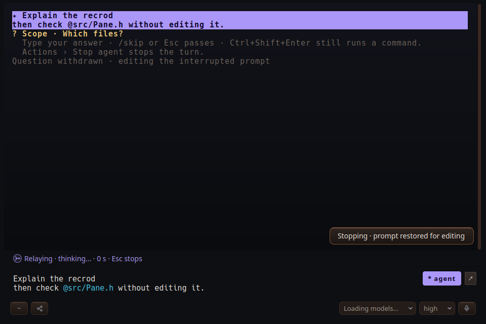

# #7Z08 — implementer evidence

Up from an empty composer first recalls a queued item, as before. With nothing queued, it
stops the locally submitted agent turn and restores the full prompt. Esc also restores the
prompt when the composer is empty; with a draft present it stops without replacing that draft.
Restoration happens synchronously on the key press. Cancellation is asynchronous and preserves
completed work and the transcript. There is no elapsed-time cutoff while a turn is starting or
running. A completed turn uses ordinary history instead.

An edited prompt submitted before cancellation finishes uses the existing interrupt/replacement
path, including before the old turn's start acknowledgement. Late old-turn events cannot
replace the newer prompt. Worker restart, configuration, rejection and turn completion clear
the recall state. Worker-backed card consoles use the complete locally submitted text rather
than the server's truncated preview. Existing popup and queue navigation keep their precedence.

## Timing comparison (checked 2026-09-24)

- [Claude Code interactive mode](https://code.claude.com/docs/en/interactive-mode#take-back-what-you-queued)
  describes Up recall while input is queued, and Esc interruption while running. This is a
  lifecycle boundary, not a documented grace period in milliseconds.
- [Codex's original restore change](https://github.com/openai/codex/commit/c0ea566bb52908915fecb2569869bbe380f22468)
  restored an interrupted prompt until substantive output/tool activity occurred; thinking
  alone did not close the window. It did not specify an elapsed-time deadline.
- [Codex's later change](https://github.com/openai/codex/commit/70a0b1eef87c4fd1398ffc77776033e5efafa645)
  removed automatic restoration of the active prompt, keeping it in history and leaving the
  composer blank. Current `codex-rs/tui/src/chatwidget/input_restore.rs` was also inspected:
  it restores queued/unacknowledged input on interruption, without a grace-period timer.

Relay implements the owner's requested active-prompt restoration rather than claiming exact
parity with either current client. The delay to actual model/tool cancellation remains the
existing worker's cancellation latency; this change does not defer editable text until then.

## Verification

- Landed `044d7b13812e26cd07a10199e89dbb982e6b3a54` on main: the exact committed tree
  built `relay` and `relay-consolemode-tests`, then passed `--recall-only` and `queuecontract`.
- Final shared-checkout run `20260924T224855Z-ef88`: consolemode passed (6.69 s),
  queuecontract passed (3.49 s), including the open-question correction case.
- Local `build/relay` built successfully as `2026-09-24.18H.05`; no user process was restarted.
- `scripts/relay-build --target relay-consolemode-tests` — passed.
- `build/relay-consolemode-tests --recall-only` under isolated XDG directories and Xvfb — passed.
- Board test run `20260924T224244Z-b7c1`: `ctest:consolemode` passed (6.25 s),
  `ctest:queuecontract` passed (3.52 s), no failures or new signals.
- Focused tests exercise both shortcuts before acknowledgement, between queued/start,
  and during a running turn; typed drafts; repeated keys; full multiline/card prompt text;
  resubmission before cancellation acknowledgement; a correction sent before the first start;
  completed-turn history; and queue recall precedence.
- Open agent questions are withdrawn locally before the restored text can be resubmitted,
  so a correction sent immediately cannot become an answer to the cancelled turn's question.
- The exact-tree build compiled successfully. Its full `consolemode` run exposed the existing
  shell-label race at `tests/h2kq_cases.h:66`, tracked separately as #5P0Q; another session's
  uncommitted fix was not included. The exact-tree gate therefore runs the focused
  `--recall-only` cases plus `queuecontract`, preserving the other session's ownership.

## Capture

`01-restored-prompt.png` is the real Pane widget under Xvfb, driven by the focused test's
synthetic worker events, immediately after Up. The sent multiline text is restored in the
composer and the toast reports that cancellation is pending. No live model was invoked for
this fixture. This is implementer evidence; independent Board verification remains pending.

