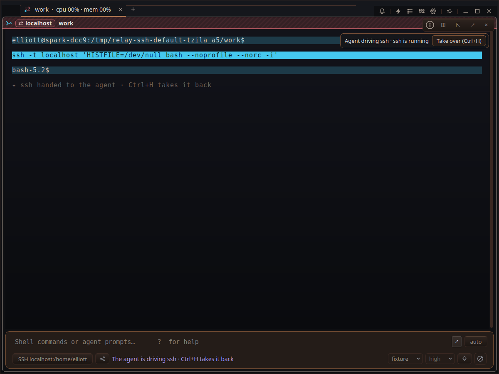

# Let the agent drive SSH sessions by default

## Issue
on ssh, let the agent drive by default

## Done means
- A new SSH login delegates its visible terminal to the agent automatically once the remote prompt is ready.
- Take over stops agent input for the rest of that SSH login; a password prompt revokes the grant.
- A program-specific human-control preference is honored, and non-SSH programs keep their existing behavior.

## Plan
**Goal.** Make the SSH login grant agent program control automatically.

**Findings.** `src/Pane.h` starts SSH in `beginLogin()`, detects the first remote prompt in `updateLoginPrompt()`, and only `beginDelegation()` currently grants the agent program input.

**Steps.** (1) Grant delegation at the first ready SSH prompt when the agent and screen are available, respecting human control. (2) Cover the one-time grant, takeover, and password boundary with targeted verification. (3) Build and drive an isolated SSH pane.

**Risks.** SSH authentication prompts occur before the ready prompt; automatic delegation must not expose them. A later prompt in the same login must not regrant control after takeover.

**Verify.** Build with `scripts/relay-build`; run targeted tests and an isolated SSH GUI drive.

## Execution Summary
- `src/Pane.h`: the first ready SSH prompt calls the existing delegation path once per login. Authentication happens before the grant; takeover and masked prompts use the existing revocation path.
- `docs/SSH-AND-MOSH.md`: documents the new default and its control boundaries.
- [Isolated GUI evidence](../../docs/qa_evidence/2026-09-23-A6SH/README.md): a real localhost OpenSSH login showed the agent banner and Take over button; Ctrl+H revoked control and returning to the prompt box did not regrant it.

## Tests
`RELAY_JOBS=2 scripts/relay-build --fast --target relay` (isolated worktree at the same committed baseline, with the Pane change applied) — passed.

`RELAY_SSH_TEST_BINARY=/tmp/relay-a6sh/build-fast/relay python3 docs/qa_evidence/2026-09-23-A6SH/drive.py` — passed.
