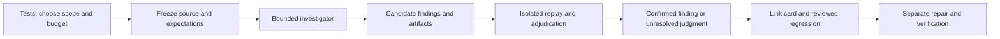

# Make Tests Discover Defects Worth Fixing

**Recommendation: use Tests to launch bounded investigations, beginning with advisory review of one frozen change in Relay’s Python test-run lifecycle, followed by controlled executable reproduction.** Keep existing checks and exploratory findings distinct, and require evidence before a finding becomes a regression test or repair assignment. A deterministic fake-child harness should be the first executable extension; parser fuzzing should follow once isolation and replay work. This sequencing tests the largest product uncertainty—whether discoveries justify their review burden—without requiring a general attack platform. The working assumption is a **general project-facing feature, with Relay as its first pilot**; the owner has not confirmed that scope. Everything below is a discussion proposal, not implementation authorization. No attack, benchmark, or runtime verification was performed for this report, and all costs, case counts, and rollout criteria are unmeasured proposals.

## Start with an investigation that ends in evidence

Card #SJTR establishes the intended direction: keep the name Tests and broaden it beyond existing checks into defect discovery. Its initial sketch is not an approved plan. The earlier cross-field research contributes the central design discipline: identify the expected behavior, choose evidence that can challenge it, and preserve unresolved judgment. Its later revision explicitly drops mandatory QA classifications in favor of actions and keeps Results separate from Tests. This proposal follows that revision rather than reviving classification chips. ([Card #SJTR](/home/elliott/repos/relay-terminal/issues/features/2026-09-21-tests-becomes-the-front-door-to-a-qa-attack-system.md), [revised synthesis](/home/elliott/repos/relay-terminal/docs/QA-ACROSS-FIELDS-RESEARCH.md:145))

The proposed first interaction is simple: select a change and a target, choose “Investigate,” see its bounded run, and inspect findings with expected behavior, observed behavior, and replay evidence. An agent proposes hypotheses and experiments; executable checks establish particular failures; a reviewer settles disputed requirements. Discovery ends before repair starts. Otherwise an investigator can erase the original failure while “helpfully” changing the code, leaving neither a trustworthy witness nor a clear account of what was wrong.

**Review-first is the smallest way to learn about relevance and nuisance reports; executable attacks are the stronger way to learn about observable failure.** Reviewing a frozen diff avoids immediate compiler integration and can target semantic mistakes outside existing assertions. Its weaknesses are speculative reports, incomplete context, and unknown recall. Fuzzing or generated action sequences explore actual behavior, but only along the interfaces and failure rules supplied by the harness. Neither dominates universally. For this pilot, review one Python protocol boundary and require replay of promising allegations before calling them confirmed. If the owner's priority is specifically discovering native-code crashes rather than evaluating the investigation workflow, choose scanner fuzzing first instead.

The first proposed boundary is starting, stopping, and recording a test run. Existing protocol tests already use a fake `ctest` executable with passing, failing, and sleeping cases, plus a temporary board. Extend that pattern conceptually with a child that exits before writing results, emits malformed results, ignores graceful termination, or streams output slowly. Predeclare candidate expectations: bounded cancellation, no orphan child, one terminal run state, retained diagnostics, and a usable subsequent run. These are requirements to agree, not guarantees established by this research. ([Existing protocol fixtures](/home/elliott/repos/relay-terminal/tests/test_tests_protocol.py:4))

A useful prototype finding would say: “Under this synthetic child behavior, Stop exceeds the agreed deadline and the next run cannot start,” accompanied by the exact child script, invocation, process trace, and fresh replay. That is an **illustrative finding, not an observed Relay defect**. A report saying merely “cancellation might race” remains a candidate. A requirement dispute remains inconclusive even when the underlying behavior reproduces.

## Choose methods by the failure they can establish

The methods below are complementary. “Cost” describes expected work and limitations, not measured Relay runtime, implementation estimates, or a universal ranking.

| Method | Concrete Relay prototype | Evidence it supplies | Main tradeoff and position |
|---|---|---|---|
| Adversarial review | Frozen Python protocol diff plus relevant callers and tests | Located hypothesis, requirement citation, proposed witness | Broad reasoning; speculative allegations require adjudication. First advisory slice. |
| Deterministic fault injection | Fake child truncates output, exits early, or resists termination | Replayed recovery/containment failure | Needs explicit lifecycle expectations. First executable extension. |
| Coverage-guided fuzzing | Fresh `SequenceScanner` consumes bounded byte inputs | Crash, sanitizer violation, stalled progress, or assertion failure | Instrumented build and corpus required; silence says little about semantics. Next native-code pilot. |
| Property/stateful testing | Temporary board: create, move, reload, inspect | Short sequence violating an independently specified invariant | Model quality determines value; generating actions alone supplies no oracle. |
| Metamorphic testing | Feed identical terminal bytes whole and split across boundaries | Violation of an agreed relation between executions | Requires carefully chosen observables; callback batching need not match. |
| Differential testing | Same restricted terminal language through two cores | Minimized behavioral disagreement | Neither implementation is automatically correct; adjudication can dominate. |
| Mutation audit | Alter one production helper and run focused tests | Sensitivity of tests to that artificial change | Measures test gaps, not necessarily existing application bugs. Add after baseline. |
| Broader chaos/simulation | Worker interruptions and reconnect schedules | Recovery behavior against declared service expectations | Larger environment and replay investment; defer until simpler faults justify it. |

For scanner fuzzing, LLVM documents an in-process byte-array target, coverage guidance, corpus replay, sanitizer integration, and execution limits. A proposed harness would start fresh per input, seed escape sequences and truncated terminators, and preserve reduced failing bytes. Instrument the exercised production code as well as the harness. Use a separate executable instead of adding libFuzzer’s `main` to a Qt Test binary. LLVM also notes that original developers no longer actively develop new libFuzzer features; that warrants a tooling choice, not an assumption that it is unusable. ([LLVM libFuzzer](https://llvm.org/docs/LibFuzzer.html), [scanner interface](/home/elliott/repos/relay-terminal/engine/core/SequenceScanner.h:21))

For stateful testing, an independent map of expected identities and persisted states can challenge board operations across reloads. Hypothesis supplies generated action sequences and shrinking and integrates with `unittest`; it would still add a development dependency. A stdlib generator is a smaller dependency choice but must provide replay and reduction itself. Saved examples should become reviewed regression fixtures; a generator’s local example database is not sufficient archival evidence. ([Hypothesis stateful testing](https://hypothesis.readthedocs.io/en/latest/stateful.html), [temporary-board fixtures](/home/elliott/repos/relay-terminal/tests/test_board.py:53))

Terminal metamorphic tests can compare final cells and cursor after whole-buffer versus chunked feeds, normalizing scanner offsets where necessary. Differential tests can compare libvterm and Ghostty only within an agreed common subset; the factory exposes that seam, but Ghostty is conditional and its availability was not verified. Exclude ambiguous extensions initially. A disagreement is a candidate, and agreement can preserve a shared wrapper error. The underlying engine also links Qt Widgets, so a headless interface does not establish a QtCore-only build. ([Terminal interface](/home/elliott/repos/relay-terminal/engine/core/VtCore.h:58), [core factory](/home/elliott/repos/relay-terminal/engine/core/VtCoreFactory.cpp:11), [engine linkage](/home/elliott/repos/relay-terminal/engine/CMakeLists.txt:97))

Mutation deserves a separate “test strength” interpretation. A survivor can reveal a weak assertion, irrelevant scope, or an equivalent change; a kill caused by infrastructure failure is not useful sensitivity. Mull supports changed-line selection, contradicting the earlier categorical claim that mutation is necessarily too slow per change. Cosmic Ray supports configurable `unittest` commands. Begin with one helper, a clean baseline, explicit timeouts, and inspected survivors in a disposable snapshot. Measure build overhead and completed mutants before choosing per-change versus periodic use. ([Mull incremental mutation](https://mull.readthedocs.io/en/latest/IncrementalMutationTesting.html), [Cosmic Ray tutorial](https://cosmic-ray.readthedocs.io/en/latest/tutorials/intro/))

## Reuse Tests while adding a separate evidence lifecycle

The code inspected in the research notes belongs to a concurrently edited checkout, not a verified release. It establishes substantial reuse opportunities, with important boundaries:

| Capability | Existing evidence | Additional work proposed |
|---|---|---|
| Tests interface | Run history, timing/reliability, Run, Stop, repeat, history navigation | Findings list with scope, budget, evidence state, replay, and disposition. ([Pane](/home/elliott/repos/relay-terminal/src/TestSuitesPane.cpp:134)) |
| Test execution | CTest/unittest discovery and explicit selected execution | Method adapters; no claim of arbitrary-stack support. ([Discovery](/home/elliott/repos/relay-terminal/backend/relay_core/test_probe.py:59)) |
| History | Append-only local test records, commit/source hashes and dirty digest | Complete immutable snapshot/environment manifests and attack artifacts. ([History](/home/elliott/repos/relay-terminal/backend/relay_core/test_history.py:140)) |
| Board handoff | Make/Attach card consumes test-row information | Finding-to-card adapter; link duplicates before promotion. ([Handoff](/home/elliott/repos/relay-terminal/src/RelayWindow.h:5635)) |
| Agents and jobs | Generic agents, process groups, stop/output controls | Investigator permissions, separate replay controller, persistent run ownership. ([Jobs](/home/elliott/repos/relay-terminal/backend/relay_core/jobs.py:2)) |
| Signals and repair | Known-check failures can start repair threads and require reruns | Keep speculative findings outside automatic repair. ([Signal pickup](/home/elliott/repos/relay-terminal/backend/relay_core/tests_protocol.py:997)) |
| Isolation/scheduling | XDG test directories and resource scopes; conversation-owned jobs | Filesystem/network containment, credential policy, durable scheduling and recovery. ([Test environment](/home/elliott/repos/relay-terminal/backend/relay_core/tests_protocol.py:1572), [scopes](/home/elliott/repos/relay-terminal/src/Isolation.h:18)) |

Do not equate existing jobs with a recurring campaign service: jobs end with their owning conversation or worker. Likewise, subagents inherit the parent workspace, and a restricted tool list is not filesystem isolation. The initial sketch’s installed `security-review` and `ultra` cloud-review workflow remains **unverified**. Source inspection found generic agent support and an effort value, not an exercised review integration. Nothing here depends on that workflow being available. ([Subagents](/home/elliott/repos/relay-terminal/backend/relay_core/subagents.py:233), [guest effort representation](/home/elliott/repos/relay-terminal/backend/relay_core/guest_harness_codex.py:117), [availability investigation](</home/elliott/repos/relay-terminal/research_notes/Relay QA attack system/existing.md>))

The proposed architecture keeps control outside the target:

Before execution, export a disposable source snapshot and scratch state, remove host credentials and agent sockets, deny external network by default, and enforce process, memory, storage, and wall-time limits. Keep inference credentials in the controller. Verify cancellation kills descendants and that artifact export cannot overwrite the workspace. Repository text and generated logs remain untrusted input. Fail the campaign closed when required containment is unavailable; resource scopes and temporary directories do not establish these protections. Native exploit testing requires a separately justified boundary, potentially a VM. These are proposed prerequisites, not a claim that existing Relay isolation satisfies them.

Use two versioned records with append-only dispositions:

| Record | Proposed minimum fields |
|---|---|
| Run | `run_id`, project/target, source and input manifest hashes, baseline, method/tool/model/prompt versions, environment/toolchain, permissions, seeds, declared and consumed budgets, timestamps, completion reason, artifact hashes, parent run |
| Finding | `finding_id`, run links, root-cause/dedup key, location at snapshot, claim, expected behavior and oracle provenance, observed behavior, original/reduced witness, replay attempts/outcomes, validity state, severity, novelty/actionability, adjudicator and disposition, linked card/regression |

A commit alone cannot identify a dirty checkout: the existing digest hashes `git diff HEAD`, omits untracked inputs, and uses an empty value for both no diff and failure. Snapshot missingness must be explicit. Finding states should distinguish candidate, reproduced, confirmed, dismissed, duplicate, and inconclusive; severity is separate. Run states must distinguish completed-with-no-findings from never-run, failed, cancelled, and budget-exhausted. Confirmed regressions can subsequently enter ordinary test history and signal handling. Existing signal semantics themselves differ: most broken checks resolve after two passes, while flaky signals require twenty. ([Digest](/home/elliott/repos/relay-terminal/backend/relay_core/test_history.py:443), [signal rules](/home/elliott/repos/relay-terminal/backend/relay_core/signals.py:99))

## Measure useful discoveries before granting authority

**No proven W7-CRITIC results were located.** Its original document is a protocol: paired planted/clean variants, blinded conditions, citation checks, repeated critics, and externally documented defects. Borrow those experimental controls, not a claim of validated deployment. Its citation ladder also separates locating a real reference from establishing that the reference entails the defect. ([W7-CRITIC protocol](/home/elliott/repos/provenance-research/docs/plans/w7-critic-protocol.md:8))

Model diversity is a hypothesis about incremental value, not proof of independence. Published research finds correlated errors across providers and architectures, although its tasks do not estimate Relay review performance. Compare one pass, a second same-family pass, and a second different-family pass at matched total budgets if resources permit; keep second passes initially blind to the first report. Measure added confirmed defects, added false reports, overlap of misses, and adjudication cost. ([Kim et al., ICML 2025](https://proceedings.mlr.press/v267/kim25e.html))

Proposed calibration begins with ten development cases for harness debugging, followed by forty sealed evaluation cases: ten independently planted defects, ten historical defects, and twenty paired repaired controls. Keep each pair and related root causes in one split. Independently establish each oracle, hide fixing commits, future tests and revealing metadata, and report public-case memorization risk. A repaired control means the target defect is absent, not that the whole project is clean. Defects4J’s stable before/after reproduction requirements offer a useful precedent, without making its selected Java defects representative of Relay. ([Defects4J](https://github.com/rjust/defects4j#the-bugs))

Freeze one configuration, allow at most ten agent-minutes per evaluation case, and agree separate setup and spend caps. The resulting 400 agent-minute ceiling is arithmetic, **not a runtime forecast or price estimate**. Compare against existing checks and, for executable exploration, a fixed generator using the same harness and budget; otherwise a good harness could be mistaken for an agent contribution. Follow mechanical validation with the next twenty eligible consecutive changes or two weeks, whichever ends first, with a proposed four-hour human triage cap. Do not select only suspicious changes.

Report known-defect recall separately for planted and historical cases; confirmed unique findings divided by adjudicated true-or-false findings; case-level false alarms on narrowly labeled controls; replay successes divided by attempted replays; and incremental novel actionable defects per attempted campaign. Include incomplete runs, duplicates, unresolved reports, setup effort, tokens/spend, wall time, and all human review minutes. Ordinary-work recall is unknown because the total defect count is unknown. Give precision bounds treating unresolved findings first as false and then as true. Repeated seeds are not independent bugs; uncertainty should respect defect/pair clustering.

An independent reviewer should adjudicate findings, with disputes and a sample of accepted and rejected reports checked again. A model-written failing assertion remains a hypothesis until its expectation is reviewed. For historical cases, require failure for the intended reason before the fix and success afterward. Preserve failed replays as “not reproduced,” especially for races. As a scale warning, zero false alarms among twenty independent genuinely negative cases still permits an approximately 13.9% one-sided 95% binomial upper bound; paired and imperfect labels further limit that interpretation. This is an illustrative calculation, not an observed result or acceptance threshold.

## Let measured bottlenecks determine the roadmap

The proposed first phase settles one target, its expectations, snapshot/replay requirements, and owner tolerances. The second delivers the bounded review-and-replay pilot, advisory throughout. Only after that should a small Findings interface and one reusable executable adapter become product work. Extend next to scanner fuzzing or stateful board operations according to observed yield and triage burden; add mutation as a separate test-strength audit. Recurring campaigns require explicit scheduling, restart/cancellation behavior, cross-project concurrency, retention, and spending controls. Per-change searches remain an option when measured latency permits them.

Stop a campaign for containment failure, credential exposure, unauthorized traffic, exhausted budgets, or inability to stop children. Invalidate evaluation after answer leakage, oracle tampering, or tuning on held-out outcomes. At the pilot review, zero incremental actionable discoveries, exhausted triage capacity, or cost above an owner's predeclared tolerance warrants redesign or stopping. One severe discovery deserves attention but does not validate the entire system. Future gates need a separate decision for a narrow defect class, fresh external evidence, appeal, rollback, and expiry when model or domain changes.

The owner’s unresolved decisions are consequential: confirm general-project scope versus Relay-only tooling; choose lifecycle review/replay versus crash-focused scanner fuzzing; permit development dependencies and agree containment; set spend and human-attention tolerances; and name who adjudicates uncertain requirements. The recommendation is general-project architecture with a Relay lifecycle pilot, on demand and advisory, with budgets chosen before results. No choice here implies approval to implement.

The product’s durable advantage would be a short path from suspicion to a small, inspectable counterexample. A large volume of confident reports would undermine that advantage. Tests should make the limits of each investigation visible and help retain useful discoveries as regression evidence, while leaving “is this the behavior we want?” with the person responsible for the project.
